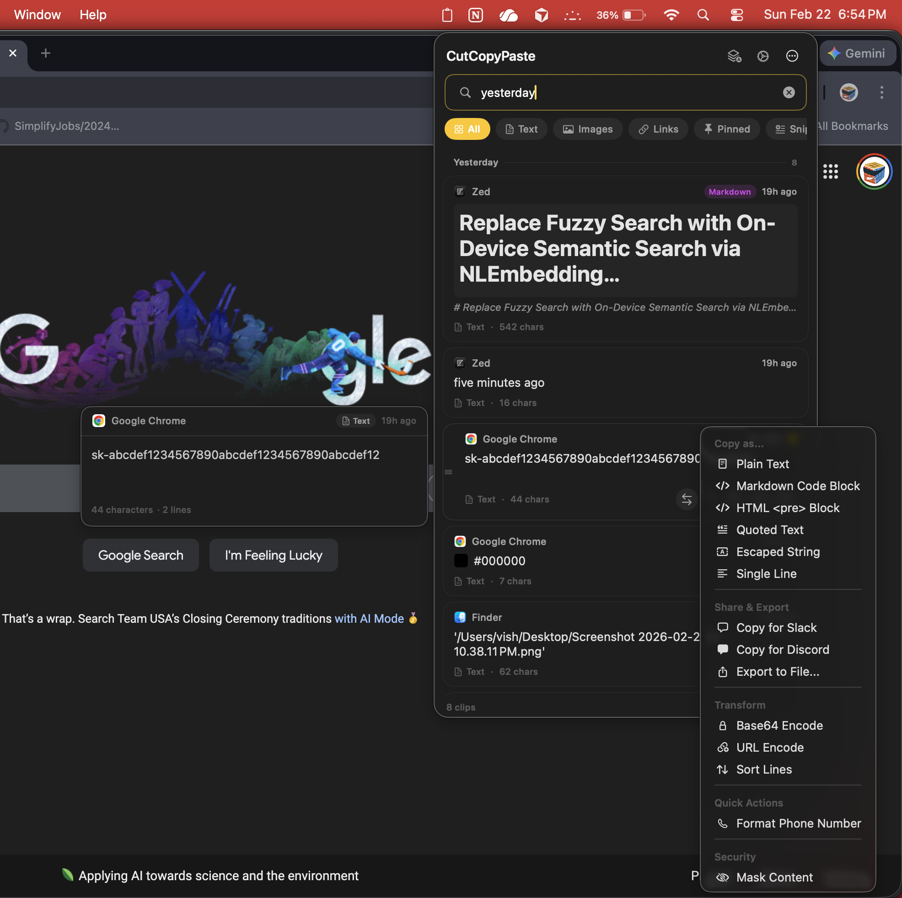
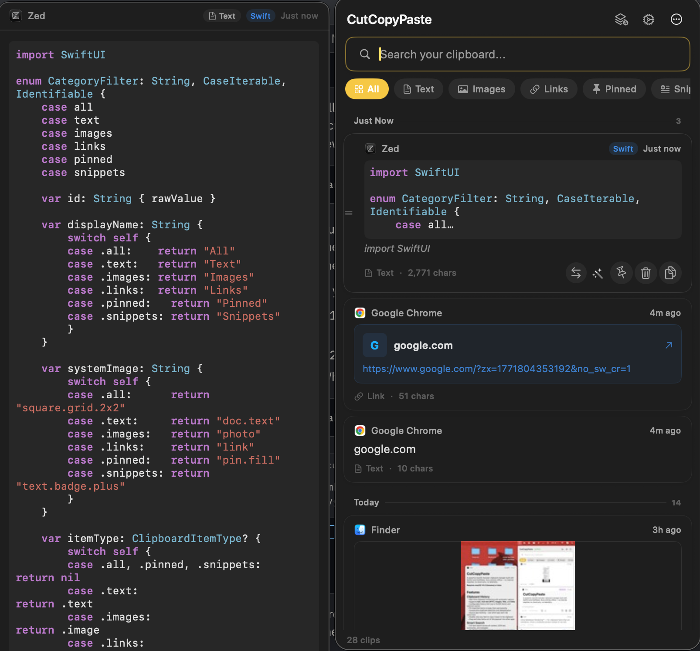
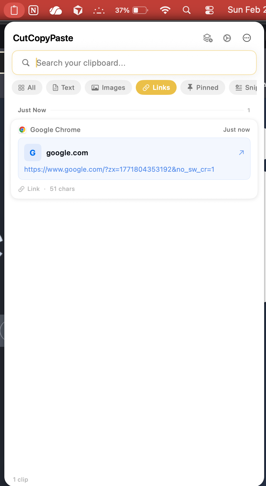
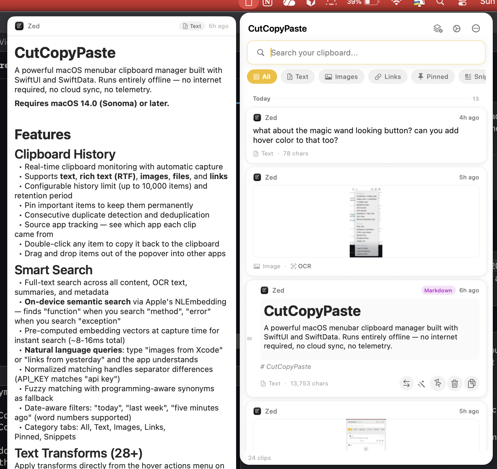
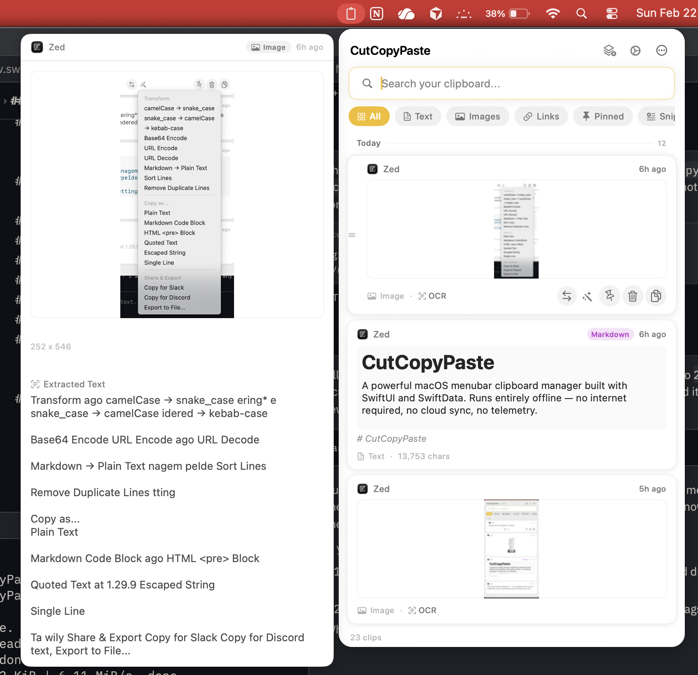
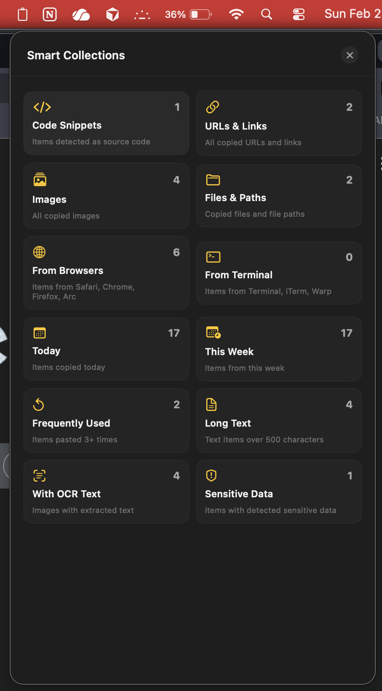

# CutCopyPaste

A powerful macOS menubar clipboard manager built with SwiftUI and SwiftData. Runs entirely offline — no internet required, no cloud sync, no telemetry.

**Requires macOS 14.0 (Sonoma) or later.**

---

## Screenshots

| Dark Mode — Search & Actions | Dark Mode — Syntax Highlighting |
|---|---|
|  |  |

| Light Mode — Link Preview | Light Mode — Markdown & OCR |
|---|---|
|  |  |

| Light Mode — Detail Preview | Smart Collections |
|---|---|
|  |  |

---

## Features

### Clipboard History
- Real-time clipboard monitoring with automatic capture
- Supports **text**, **rich text (RTF)**, **images**, **files**, and **links**
- Configurable history limit (up to 10,000 items) and retention period
- Pin important items to keep them permanently
- Consecutive duplicate detection and deduplication
- Source app tracking — see which app each clip came from
- Double-click any item to copy it back to the clipboard
- Drag and drop items out of the popover into other apps

### Smart Search
- Full-text search across all content, OCR text, summaries, and metadata
- **On-device LLM search** (macOS 26+) — uses Apple's Foundation Models framework with the on-device 3B parameter model for true natural language understanding of search queries
- Conversational queries like "that error log from Xcode I copied today" are parsed by the LLM into structured filters (content type, date range, source app, text query)
- **Automatic fallback** — on macOS 14–15 or when Apple Intelligence is unavailable, the app seamlessly falls back to heuristic regex-based intent parsing
- **On-device semantic search** via Apple's NLEmbedding — finds "function" when you search "method", "error" when you search "exception"
- Pre-computed embedding vectors at capture time for instant search (~8-16ms total)
- **Natural language queries**: type "images from Xcode" or "links from yesterday" and the app understands
- Normalized matching handles separator differences (API_KEY matches "api key")
- Fuzzy matching with programming-aware synonyms as fallback
- Date-aware filters: "today", "last week", "five minutes ago" (word numbers supported)
- Category tabs: All, Text, Images, Links, Pinned, Snippets

### Text Transforms (28+)
Apply transforms directly from the hover actions menu on any text item:

| Category | Transforms |
|---|---|
| **Case** | camelCase to snake_case, snake_case to camelCase, to kebab-case |
| **Encoding** | Base64 encode/decode, URL encode/decode |
| **JSON** | Prettify, Minify, JSON to Swift Struct (with Codable + CodingKeys) |
| **Code Gen** | cURL to URLSession Swift code, SQL CREATE TABLE to SwiftData @Model |
| **Markup** | XML prettify, Markdown to plain text |
| **Colors** | Hex to RGB, RGB to Hex |
| **Code Formatting** | Strip line numbers, Normalize whitespace, Sort lines, Remove duplicate lines |

Transforms are context-aware — only applicable transforms appear based on content analysis.

### Sensitive Data Detection
Automatically detects and flags sensitive content on capture:

- AWS access keys and secret keys
- OpenAI API keys
- Stripe keys (test and live)
- GitHub tokens
- Generic API keys and secrets
- Credit card numbers (with Luhn validation)
- Social Security Numbers
- PEM private keys
- Database connection strings (MongoDB, MySQL, Postgres, Redis)
- Passwords in config files

Items with detected sensitive data show a warning badge. Enable **auto-mask** to automatically hide sensitive content in the UI.

### Password Manager Protection
- Automatically ignores clipboard items marked as concealed or transient using the `org.nspasteboard.ConcealedType` / `TransientType` / `AutoGeneratedType` standard
- Works with 1Password, Bitwarden, KeePassXC, LastPass, and any app that follows the standard
- More reliable than app-based exclusion — catches concealed content from **any** source
- Configurable in Settings > Security (enabled by default)

### Monitoring Controls
- **Pause/Resume** — toggle clipboard monitoring on/off from the header or overflow menu; an orange banner indicates when paused
- **Skip Next Copy** — one-click to ignore the very next clipboard change (auto-resets after 30 seconds); useful for one-off sensitive copies
- **Configurable check interval** — tune clipboard polling frequency from 0.25s (fastest) to 2.0s (battery saver) in Settings > General

### Paste Without Formatting
- Strip rich text formatting and paste as plain text with a single click
- Dedicated button on rich text items in the action bar
- Also available in the context menu and Actions menu
- Automatically dismisses popover and simulates paste (Cmd+V)

### OCR (Image Text Extraction)
- Extract text from any captured image using Apple's Vision framework
- **Auto-OCR enabled by default** — text is extracted automatically on capture
- **Spatial-aware text reconstruction** — uses Vision bounding box data to preserve paragraph spacing and line structure
- Confidence filtering removes low-quality OCR artifacts
- Smart line joining heuristics: detects wrapped prose vs code vs lists
- Consecutive duplicate removal and whitespace normalization
- Extracted text becomes searchable alongside regular clipboard content
- View and copy OCR results from the item detail overlay

### Snippets & Templates
- Create reusable text templates with `{{placeholder}}` syntax
- Built-in variables: `{{date}}`, `{{time}}`, `{{clipboard}}`, `{{uuid}}`, `{{timestamp}}`
- Custom variables prompt a fill-in dialog before insertion
- Organize snippets into folders
- Ships with 15 built-in templates: meeting notes, bug report, PR description, email reply, standup update, changelog entry, function skeleton, API request (fetch), Python script header, SQL query, shell script, TODO comment, code review comment, regex pattern, date stamp
- Usage tracking (most-used snippets rise to the top)

### Diff & Merge
- **Compare**: Hover any item and click the compare button to select it — a floating bar appears showing selection progress with a "Compare" button when ready
- **Merge**: Click the merge button in the header to enter merge mode — selected items highlight purple, then merge with configurable separator
- **Side-by-side diff** with paired removed/added lines, character-level inline highlighting, line numbers, and column headers showing source app and time

### Clipboard Rules
- Create rules that automatically transform content on capture
- Filter by source app (bundle ID) and content type
- Available auto-transforms: strip ANSI codes, prettify JSON, strip URL tracking parameters, regex find/replace, trim whitespace, case conversion
- Ships with default rules for stripping terminal color codes
- Test rules inline before saving

### Workspace Awareness
- Detects your current project context from the frontmost app
- **Xcode**: extracts project name from window title
- **VS Code**: extracts workspace folder
- **Terminal / iTerm2**: extracts current working directory
- **Finder**: tracks the active folder
- Filter clipboard history by workspace using the chip bar below the category tabs

### Analytics Dashboard
- Copies per day chart (last 30 days)
- Content type distribution (pie chart)
- Peak usage hours (24-hour breakdown)
- Top source apps
- Most re-used items
- Total item count and daily average

Open from the overflow menu (ellipsis) in the popover header.

### Text Summarization
- Items longer than 200 characters get an automatic one-line summary
- Full stats available in the detail overlay: character/word/line/sentence/paragraph counts, estimated reading time
- Key phrase extraction via Apple's NaturalLanguage framework

### Quick Actions
Context-aware actions appear on hover based on content type:
- **URLs**: open in browser, strip tracking parameters, extract domain
- **JSON**: validate, extract keys
- **Colors**: preview swatch (hex colors show inline), convert formats
- **UUIDs**: detect and regenerate
- **Timestamps**: convert between epoch, ISO 8601, and human-readable

### Syntax Highlighting
- Automatic programming language detection on capture (Swift, Python, JavaScript, TypeScript, Go, Rust, Java, Ruby, C, HTML, CSS, SQL, Shell, JSON, YAML, XML)
- Color-coded syntax preview in clipboard items — keywords, strings, comments, numbers, types, and functions
- Language badge displayed on each code snippet card
- Full syntax-highlighted view in item detail overlay
- Dark and light mode aware color schemes
- Markdown detection runs before language detection to prevent false positives (e.g. README files with SQL keywords in prose)

### Inline Markdown Rendering
- Clipboard items containing markdown are automatically detected and rendered as styled text
- **Score-based detection** — headings, code fences, bold, lists, links, blockquotes each contribute to a confidence score (threshold: 4+)
- Rendered preview in clipboard item cards with purple "Markdown" badge
- Full rendered markdown in item detail overlay (300px scrollable view)
- Supports: headings (h1–h6), **bold**, *italic*, ~~strikethrough~~, `inline code`, fenced code blocks, bullet and numbered lists, blockquotes, links, images, horizontal rules
- NSAttributedString-based rendering — no WebKit dependency, fully offline
- Dark and light mode aware

### Regex Search
- Toggle between natural language search and regex pattern matching
- Visual indicator for regex mode with monospaced input font
- Invalid regex patterns flagged with warning icon
- Full NSRegularExpression support for power users

### Smart Collections
- Auto-categorized views: Code Snippets, URLs & Links, Images, From Xcode, From Browsers, From Terminal, Today, This Week, Frequently Used, Long Text, With OCR Text, Sensitive Data
- Grid-based collection browser with item counts
- One-click filtering from any collection
- Active collection shown as dismissible chip

### Time-Grouped History
- Items automatically grouped by time period: Just Now, Today, Yesterday, This Week, This Month, Earlier
- Pinned items always appear in their own section at the top
- Section headers with item counts
- Toggle on/off in Appearance settings

### Copy as... Formats
- Copy clipboard text in different formats from the actions menu or context menu:
  - Plain Text, Markdown Code Block, HTML `<pre>` Block, Quoted Text, Escaped String, Single Line
- Language-aware code blocks (automatically uses detected language)

### Share & Export
- **Copy for Slack** — wraps code in triple-backtick block with language tag
- **Copy for Discord** — same format for Discord code blocks
- **Copy as Markdown Link** — converts URLs to `[domain](url)` format
- **Export to File** — save any item as .txt, .png, or .rtf via save panel
- **Create GitHub Gist** — attempts `gh gist create` if GitHub CLI is installed

### Copy Count Badge
- Menu bar icon changes to filled clipboard when new items are captured since last viewed
- Unseen count resets automatically when popover is opened

### Paste & Auto-Type
- **Double-click** or press **Return** to copy an item and auto-paste it into the frontmost app
- Popover closes automatically, Cmd+V is simulated — seamless one-action paste
- Copy button (single click) still puts content on the clipboard without pasting

### Onboarding
- First-run welcome flow introduces key features and shortcuts
- Prompts for Accessibility permission grant (required for global hotkey)
- Privacy reassurance — "100% offline" highlighted upfront

### Undo Delete
- Deleting an item shows a floating toast with an **Undo** button
- Auto-dismisses after 4 seconds — re-saves the item if you tap Undo in time

### Export & Import
- **Export** entire clipboard history to JSON (including images as base64)
- **Import** from a previously exported file to restore or migrate between Macs
- Available in Settings > General > Data Transfer

---

## UI

Clean, card-based design:

- **Card layout** — each clip is a self-contained card with source app icon, content preview, and metadata
- **Source app icons** from macOS displayed on each card for instant visual identification
- **Rich content previews** — text at 13pt with 3-line limit, full-width image thumbnails, color swatches for hex codes
- **Flat pill tab bar** — accent-filled capsule for the active filter, clean flat pills for the rest
- **Larger search bar** — prominent placement with 13pt font, "Search your clipboard..." placeholder
- **Privacy badge** — green "Offline" badge in the header reinforces data stays local
- **Minimal header** — clean app title with just settings and overflow menu, no clutter
- **Hover action bar** — compare, transforms, pin, delete, and copy buttons appear in the card footer on hover
- **Compare bar** floats above the footer when items are selected for diff
- **Sensitive data tooltip** — hover the warning badge to see what types were detected
- Overlay-based modals (no system sheet conflicts with menubar windows)
- **Undo toast** — floating material-backed toast with undo action on delete
- Keyboard navigation: arrow keys to select, Enter to auto-paste, Escape to deselect
- Staggered card entry animations
- **Haptic feedback** on copy, pin, and delete actions
- **Full VoiceOver support** — accessibility labels on all interactive elements
- **High-contrast readability** — carefully tuned opacity levels and foreground styles for clear visibility in both light and dark modes
- **Performance optimized** — LRU caches for syntax highlighting and markdown rendering, static caches for app icons and hex colors, lazy image loading, JPEG thumbnails for lower memory, stagger animations limited to visible items, batched database operations, coordinator-based NSView update skipping

---

## Settings

| Tab | Options |
|---|---|
| **General** | Max history, retention days, deduplication, launch at login, sound on copy, clipboard check interval, export/import |
| **Appearance** | Theme (System / Light / Dark), compact/comfortable mode, popover dimensions, show timestamps, show source app, time-grouped history |
| **Security** | Concealed type protection, detect sensitive data, auto-mask |
| **Shortcuts** | Global toggle hotkey (default: Cmd+Shift+V), **live shortcut recording** — click and press any key combo to rebind |
| **Exclusions** | Apps to never capture from (1Password, Bitwarden, LastPass, Keychain Access by default) |
| **Rules** | Create, edit, enable/disable, and test clipboard auto-transform rules |
| **About** | Version info, architecture, build details |

---

## CLI Tool (`ccp`)

A companion command-line tool that shares the same SwiftData store as the GUI app.

```bash
# List recent clipboard history
ccp list
ccp list --count 20 --full

# Add text to clipboard history
ccp copy "some text"

# Output an item from history (0 = most recent)
ccp paste 0

# Search clipboard history
ccp search "query"
```

---

## Installation

### Direct Download
Download the latest DMG from [GitHub Releases](https://github.com/chesspatzer/CutCopyPaste/releases).

**First launch (important):** Since the app is not yet notarized with Apple, macOS Gatekeeper will block it on first open. To launch:

1. Open the DMG and drag **CutCopyPaste** to **Applications**
2. **Right-click** (or Control-click) the app in Applications and choose **Open**
3. Click **Open** in the dialog that appears
4. The app will launch and appear in your **menu bar** (no Dock icon — it's a menu bar app)

You only need to do this once — subsequent launches work normally.

> **Alternatively**, run this in Terminal to remove the quarantine flag:
> ```bash
> xattr -cr /Applications/CutCopyPaste.app
> ```

The app checks for updates automatically via Sparkle — you can also check manually from **Settings > About > Check for Updates**.

### Mac App Store
Also available on the Mac App Store (sandboxed build). The App Store version has a few limitations compared to the direct download:
- Auto-paste (simulated Cmd+V) is disabled — you press Cmd+V manually after copying
- Workspace detection uses app name only (no window title extraction)
- Global hotkey works but cannot consume the key event

---

## Building

Requires [XcodeGen](https://github.com/yonaskolb/XcodeGen) and Xcode 26+ (for Foundation Models support; Xcode 15+ for basic build).

```bash
# Generate the Xcode project
xcodegen generate

# Build the direct distribution version (with Sparkle OTA updates)
xcodebuild -scheme CutCopyPaste -destination 'platform=macOS' build

# Build the App Store version (sandboxed)
xcodebuild -scheme CutCopyPaste-AppStore -destination 'platform=macOS' build

# Build the CLI tool
xcodebuild -scheme CutCopyPasteCLI -destination 'platform=macOS' build
```

Or open `CutCopyPaste.xcodeproj` in Xcode and run the **CutCopyPaste** scheme.

The project uses an `APPSTORE` compiler flag to control behavioral differences between the two builds. The `CutCopyPaste-AppStore` scheme archives with the `Release-AppStore` configuration, which enables App Sandbox and compiles out Sparkle.

---

## Architecture

- **100% SwiftUI + SwiftData** — no UIKit, no Core Data
- **Sparkle** for OTA updates (direct distribution only; compiled out for App Store)
- **No internet access** — everything runs locally using Apple frameworks (Foundation Models for LLM search, Vision for OCR, NaturalLanguage for NLP, Charts for analytics). The only network use is Sparkle checking for updates.
- **Strict concurrency** — `@MainActor` isolated AppState, `@ModelActor` services

### Project Structure

```
CutCopyPaste/
├── App/                    # App entry point, AppState
├── Models/                 # SwiftData models (ClipboardItem, Snippet, ClipboardRule)
├── Services/               # Business logic (20 services)
│   └── Transforms/         # Transform implementations (9 files, 28+ transforms)
├── Views/
│   ├── MainPopover/        # Primary UI (list, search, tabs, overlays)
│   ├── Settings/           # Settings tabs
│   ├── Snippets/           # Snippet management
│   ├── Analytics/          # Dashboard and charts
│   ├── Onboarding/         # First-run welcome flow
│   └── Components/         # Reusable buttons, badges, menus
├── Extensions/             # Transferable conformance, helpers
└── Utilities/              # Constants, keyboard shortcuts, LRU cache

CutCopyPasteCLI/            # CLI tool (list, copy, paste, search)
```

---

## Privacy

- All data stays on your Mac — no network requests, no analytics, no telemetry
- **Concealed type filtering** — automatically ignores items from password managers using the `org.nspasteboard.ConcealedType` standard
- Password manager apps are also excluded by bundle ID as a secondary safeguard
- **Skip Next Copy** and **Pause Monitoring** for one-off or extended privacy needs
- Sensitive data detection warns you about accidentally copied secrets
- Masking hides sensitive content in the UI without deleting it
